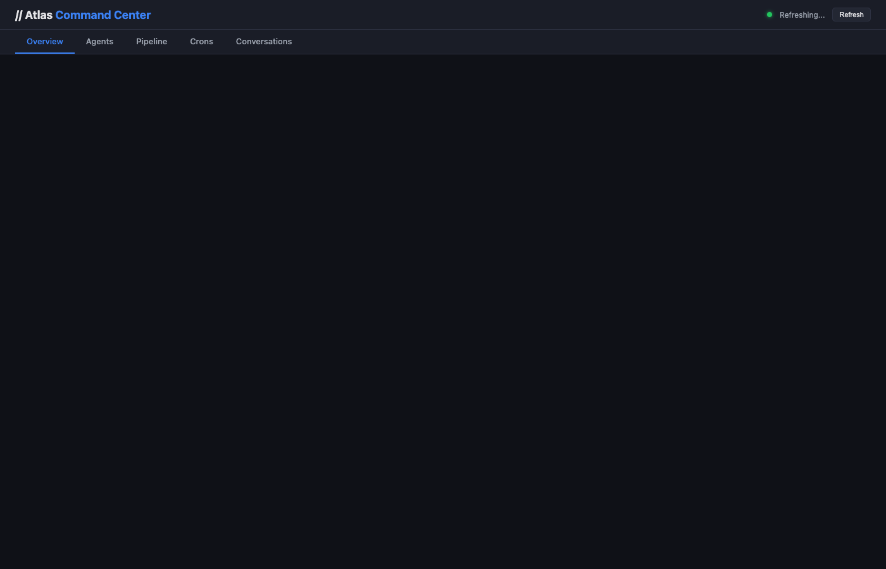

# openclaw-dashboard

**A lightweight dashboard for monitoring OpenClaw agent fleets.**

Single HTML frontend + tiny Node.js server. Zero dependencies beyond Node itself.  
Built for solo operators and small teams who want visibility without spinning up Postgres, Redis, or Docker.



> ⚠️ **v0.1 — Early, useful, imperfect.** Some things work, some don't yet. Sharing early because that's how building in public works.

## What works today

- ⚡ **Real-time overview** of agents, sessions, and cron jobs
- 🗓️ **Cron monitoring** — schedule, timezone, next run, enabled/disabled status
- 🧱 **Pipeline / Kanban view** — GitLab issues across projects
- 💬 **Conversation browser** — per-agent session history
- 🔄 **Auto-refresh** every 30s
- 🧰 **Zero external dependencies** — just Node.js

## What doesn't work yet

- ❌ **Message/Task modals** — UI exists but actions aren't wired to the backend ([#1](../../issues/1))
- ❌ **Markdown rendering** — conversation content shows as raw text
- ❌ **Auth** — no password/token gate, anyone on the network can access ([#2](../../issues/2))
- ❌ **Auto-refresh UX** — can collapse open conversation threads

See all [open issues](../../issues) for the full roadmap.

## Architecture

```
┌─────────────┐     ┌──────────────┐     ┌─────────────────┐
│  index.html │────▶│  server.js   │────▶│ OpenClaw runtime │
│  (frontend) │     │  (Node HTTP) │     │ (~/.openclaw/)   │
└─────────────┘     └──────────────┘     └─────────────────┘
                           │
                           ▼
                    ┌──────────────┐
                    │  GitLab API  │ (optional)
                    └──────────────┘
```

- **Frontend:** Single `index.html` file — dark theme, tabbed UI, vanilla JS
- **Backend:** `server.js` — lightweight Node HTTP server, reads OpenClaw config/session/cron files directly
- **Data source:** Your local OpenClaw runtime directory (`~/.openclaw/`)
- **GitLab integration:** Optional — pulls open issues from configured projects

## Quick Start

### 1. Clone

```bash
git clone https://github.com/anis-marrouchi/openclaw-dashboard.git
cd openclaw-dashboard
```

### 2. Configure (environment variables)

```bash
export DASHBOARD_PORT=8090              # Default: 8090
export DASHBOARD_BIND=127.0.0.1         # Default: 127.0.0.1 (localhost only)
export OPENCLAW_CONFIG=~/.openclaw/openclaw.json  # Path to your OpenClaw config

# Optional: GitLab integration
export GITLAB_TOKEN=your-gitlab-token
export GITLAB_URL=https://gitlab.com/api/v4
export GITLAB_PROJECTS=123:MyProject,456:AnotherProject  # id:name pairs
```

### 3. Run

```bash
node server.js
# Dashboard running at http://127.0.0.1:8090
```

That's it. No `npm install`, no build step.

## API Endpoints

| Endpoint | Description |
|---|---|
| `GET /api/overview` | All data: agents, crons, sessions, issues, counts |
| `GET /api/agents` | Agent list with skills and config |
| `GET /api/crons` | All cron jobs with schedule and state |
| `GET /api/sessions` | Recent sessions (last 50) |
| `GET /api/issues` | Open GitLab issues (requires GITLAB_TOKEN) |
| `GET /api/conversations?agent=main&limit=50` | Conversation history per agent |

## Who this is for (and not for)

**Good fit:**
- You already run OpenClaw and want a visual overview
- You're comfortable with Node.js and env vars
- You want something lightweight, not an enterprise platform

**Not a good fit (yet):**
- You want a turnkey SaaS dashboard
- You need auth, RBAC, or multi-tenant support
- You want to send commands/messages from the UI (not implemented yet)

## Roadmap

- [ ] Wire Message/Task modals to actual OpenClaw API ([#1](../../issues/1))
- [ ] Add basic auth ([#2](../../issues/2))
- [ ] Cron run history per cron ([#3](../../issues/3))
- [ ] Session cost/token tracking ([#4](../../issues/4))
- [ ] Search/filter on conversations and crons ([#5](../../issues/5))
- [ ] Real-time WebSocket updates ([#6](../../issues/6))
- [ ] Agent activity timeline ([#7](../../issues/7))

## Contributing

PRs welcome. Keep it lightweight and dependency-free.

1. Fork the repo
2. Make your changes
3. Open a PR with a clear description

## License

MIT

## Built by

[Noqta](https://noqta.tn) — building in public, sharing what works and what doesn't.
